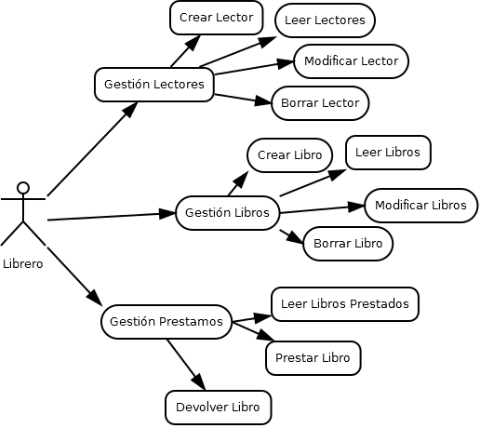
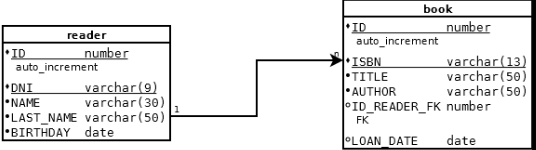
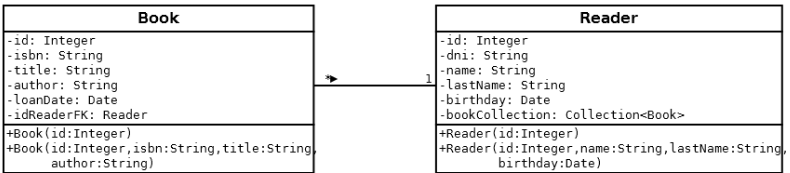

#Library REST
=========================================================

Este proyecto es un cliente REST dirigido hacia una librería o biblioteca. La idea principal es que el librero/bibliotecario tenga acceso al CRUD de usuarios, CRUD de libros y la gestión de las devoluciones y préstamos de estos.

## Tecnología usada

Se ha implementado el servicio REST como un servlet Java que corre sobre GlashFish usando como persistencia MySQL.

El cliente está programado en HTML5 y JavaScript, usando JQuery para la gestión de las peticiones a través de objetos JSON.

### Casos de uso

El librero (actor) podrá tener acceso a la gestión de lectores, libros y prestamos. Como se puede observar en el diagrama de casos de uso sobre lectores y libros puede realizar un CRUD completo, pero en el caso de prestamos tan sólo tiene acceso a un listado con los libros prestados, a quien han sidos prestados y en qué fecha; la acción de prestar el libro y la acción de devolver el libro. No hemos incluido borrar un préstamos porque pensamos que con esas dos acciones podemos cubrir las necesidades del librero.

### Diagrama Entidad/Relación

En este mostramos el diseño previo a la realización de la BD. Hemos pensado que la relación sería de 1 a n dado a que un usuario puede tener muchos libros pero un libro no puede ser tenido por muchos usuarios.

### Diagrama de clases

Este muestra el diseño UML del POJO usado. Hemos pensado que las clases están asociadas * a 1 ya que Book tiene como atributo un Reader y Reader tiene como atributo una colección de Book. Esto parte también del diseño de la propia BD.

#### Instalación

Este programa puede ser clonado directamente desde GitHub y usado para realizar un deploy en un servidor GlashFish.

